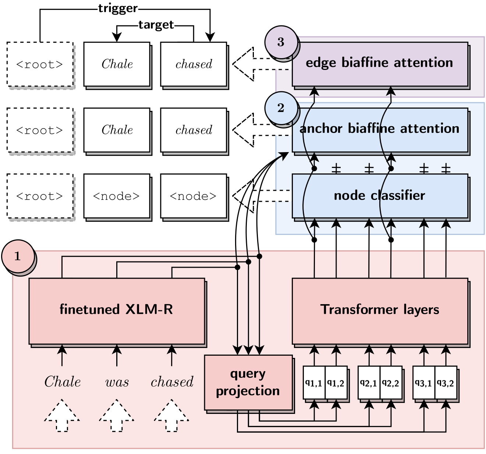
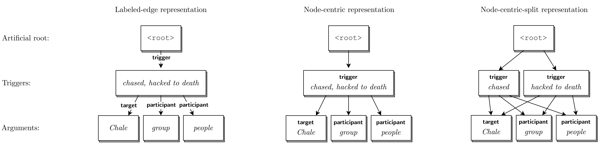

# EventGraph at CASE 2021 Task 1 Subtask 4

This repository provides the source code of our paper "EventGraph at CASE 2021 Task 1: A General Graph-based Approach to Protest Event Extraction".

<p align="center">

</p>

## How to run

### :feet: &nbsp; Preprocessing

Convert BIO to graph(mrp) format

```shell
cd preprocess

python3 preprocess.py --data_dir <DATA_DIR> --output_dir <OUT_DIR>
```

By default, all datasets are located in `data` folder as following:

```
data
├── labeled_edge_mrp
│   ├── case_all
│   └── case_final
├── node_centric_mrp
│   ├── case_all
│   ├── case_all_split
│   ├── case_final
│   └── case_final_split
├── raw
│   ├── case_all
│   ├── case_all_split
│   ├── case_final
│   └── case_final_split
└── sharedtaskOfficial
    ├── test
    └── train
```

Example graphs for sentence: "Chale was allegedly chased by a group of about 30 people and was
hacked to death with pangas, axes and spears."

<p align="center">

</p>

### :feet: &nbsp; To train

To train the model with difference graph encodings, specify the configurations located in `perin/config`

Train with development data.


```shell
cd perin

sbatch run.sh <node_case.yaml>
```

Train with all official training data.

```shell
cd perin

sbatch run.sh <node_case_final.yaml>
```

## Citation

```
TBA
```